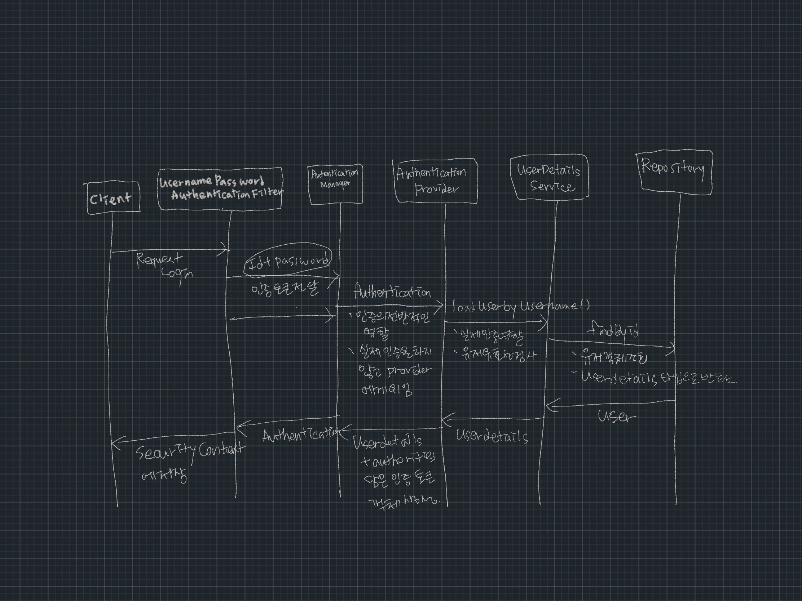

### Authentication
- 사용자의 인증 정보를 저장하는 토큰개념.
- 인증 시 id와 password를 담고 인증 검증을 위해 전달되어야 한다.
- 인증 후 최종 인증결과 (user, 권한정보)를 담고 SecurityContext에 저장되어 전역적으로 참조가 가능하다.

```java
import org.springframework.security.core.context.SecurityContext;
import org.springframework.security.core.context.SecurityContextHolder;

Authentication authentication = SecurityContextHolder.getContext().getAuthentication();
```

#### 구조
1. principal: 사용자 아이디 혹은 User 객체를 저장
2. credentials: 사용자 비밀번호
3. authorities: 인증된 사용자의 권한 목록
4. details: 인증 부가 정보
5. authenticated: 인증 여부


### SecurityContext
- Authentication 객체가 저장되는 보관소로 필요 시 언제든지 Authentication 객체를 꺼내어 쓸 수 있도록 제공되는 클래스
- ThreadLocal에 저장되어 아무 곳에서나 참조가 가능하도록 설계
- 인증이 완료되면 HttpSession에 저장되어 어플리케이션 전반에 걸처 전역적인 참조가 가능

### SecurityContextHolder
- SecurityContext 객체 저장 방식
  - MODE_THREADLOCAL: 스레드당 SecurityContext 객체를 할당, 기본값
  - MODE_INHERITABLEDTHREADLOCAL: 메인 스레드와 자식 스레드에 관하여 동일한 SecurityContext를 유지
  - MODE_GLOBAL: 응용 프로그램에서 단 하나의 SecurityContext를 저장한
- SecurityContextHolder.clearContext() : SecurityContext 정보 초기화


### SecurityContextPersistenceFilter
#### securityContext 객체의 생성, 저장, 조회
- 익명 사용자
  - 새로운 SecurityContext 객체에 생성하여 securityContextHolder에 저장
  - AnonymousAuthenticationFilter에서 AnonymousAuthenticationToken 객체를 SecurityContext 에 저장
- 인증 시
  - 새로운 SecurityContext 객체를 생성하여 securityContextHolder에 저장
  - UsernamePasswordAuthenticationFilter(FormLogin) 에서 인증 성공 후 SecurityContext에 UsernamePasswordAuthenticationToken 객체를 SecurityContext에 저장
  - 인증이 최종 완료되면 Session에 SecurityContext를 저장
- 인증 후
  - Session 에서 SecurityContext에 꺼내어 SecurityContextHolder에서 저장
  - SecurityContext 안에 Authentication 객체가 존재하면 계속 인증을 유지한다.
- 최종 응답 시 공통
  - SecurityContextHolder.clearContext()를 이용하여 제거한다.
  - 매 요청마다 저장하므로 제거하고 저장한다.


### Authentication Flow


### AuthenticationManager
- AuthenticationProvider 목록 중에서 인증 처리 요건에 맞는 AuthenticationProvider를 찾아 인증처리를 위임한다.
- 부모 ProviderManager를 설정하여 AuthencationProvider를 계속 탐색할 수 있다.